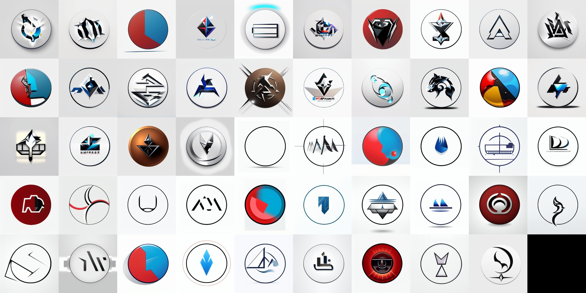

# Seamless Stable Diffusion CS

**Project 3A - Headmind Partners IA (Stable Diffusion)**

<p align="center">
  
</p>

## Overview

This project aims to explore and enhance the capabilities of Stable Diffusion, a deep learning, text-to-image model, by focusing on seamless image generation and blending techniques. Stable Diffusion is primarily used to generate detailed images based on text descriptions but can also be applied to tasks such as inpainting, outpainting, and image-to-image translations guided by text prompts.
This scope of this project also tackles a down-to-earth problematic: Generation of Logo (through image2image).

## Repository Structure

The repository is organized into the following directories and files:

- **Benchmark:**: Contains benchmarking scripts and results to evaluate the performance of the Stable Diffusion models, Huggingface Baseline Model, and annotations gathered accross blindfolded reviewers for quantitative benchmarks. #TODO: LLM Score and CLIP Score.
  
- **Blending**: Implements various image blending methods (gaussian blur mainly) to achieve seamless transitions between images generated by Stable Diffusion
  
- **LogoLho**: Script to train our own LoRA using huggingface `logo-wizard/modern-logo-dataset`
  
- **Manim**: Utilizes the Manim animation engine to create visualizations that demonstrate the processes and results of the Stable Diffusion models - Not pursued as deliverables were defined later as a deck and report
  
- **SLICK**: Implements the SLICK algorithm for enhancing image coherence and quality in the context of Stable Diffusion outputs (leveraging K-means for regional modifications only)
  
- **StableDiffusion**: Contains the core post-processing techniques tried for the sake of improving stable diffusion results, leveraging knowledge of computer vision - includes various techniques to upscale and denoise the output images of our comfyUI workflows.
  
- **Workflows**: Defines automated comfyUI json workflows, essential to run the models & stable diffusion LoRA (including lhotte-v3 which was trained by us)

Additional files include:

- **Article LEDITs.pdf**: A research article or paper related to the project, providing in-depth insights and findings.
  
- **LICENSE**: The MIT license governing the use and distribution of the project's code.
  
- **README.md**: This file, offering an overview and guidance on the project's structure and objectives.
  
- **Stable-Diffusion-Image-Synthesis.pdf**: A document detailing the image synthesis capabilities and methodologies employed in Stable Diffusion.
  

## Getting Started

To get started with this project:

**Clone the repository**:

   ```bash
   git clone https://github.com/louislhotte/seamless-stable-diffusion-cs.git
   ```


This README provides a structured overview of the repository, guiding users through its purpose, structure, and usage.


## Acknowledgements
- We acknowledge the contributions of the open-source community and the developers of Stable Diffusion, whose work forms the foundation of this project. 

**Additionally, we worked on this project in the scope of our school - CentraleSupélec (AI Field of Study) - in collaboration with Headmind Partners (@ClémentNicolle)**

